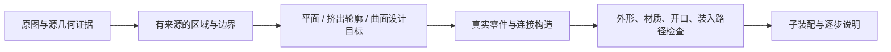

# 局部设计区域：本轮结论与实施契约

## 结论

当前产品目标仍是：原图外形与关键对象保留，真实零件能够买到和拼搭，每一步能操作。**截图中的门框杂块尚未完成修复，任意图片达到套装质量尚未实现。**

此前排除了“给识别出的门窗再做一次局部网格压平”这条实现路线：四处小屋平面拟合都通过原相机投影检查，但标准档的最终体素、边界颜色和内部颜色完全不变。神庙门框两侧也不符合单一平面的条件。已实现可选来源归属账本和离线区域目标/目录表面评分；第十节新增一个减少小屋窗口遮挡、通过完整连接重规划的软件候选。它仍未通过整体外观、完整装入路径和采购验收，未接入自动生成。

冻结的摘要在 [局部区域证据](/Users/huihui/Documents/乐高图纸生成/benchmarks/local-region-design-2026-10-04.json)。这些几何/颜色试验绑定审计时的 `0a1dea3` 和转换指纹 `ea8b01354e21a4b16e6fbdf4eb7624e7fbe7681db7360eab502ccee8e046d0b4`。它们没有接入生成算法；随后新增的结构用途标记单列在第六节，不能把旧指纹当成修改后的指纹。

## 1. 雕像后面究竟是什么

本轮绑定的是当前参考配色神庙 **8,613 件**模型和可选反照率 **7,953 件**控制模型。用户历史截图为 8,563 件，不能把任一缓存模型当作截图的精确复现。两份控制模型的原图、原生 GLB、相机、声明壁龛几何和三个探针的主体占用坐标一致。

| 位置（凸点、薄板层） | 当前参考配色模型 | 来源与限制 |
| --- | --- | --- |
| A：`(19,50,25)` | `3070b`，棕色 | 7 个真实源面与该格相交；附近 113 面的平面 RMS 为 0.347 凸点，包含转角/弯曲结构，不支持整体压平 |
| B：`(30,50,25)` | `3069b`，沙色 | 6 个真实源面与该格相交；附近 115 面的平面 RMS 为 0.336 凸点，同样不支持单平面 |
| C：`(21,76,22)` | `3034`，沙色 2×8 薄板 | 无源面直接穿过该格；坐标、尺寸和安装说明精确对应 `installCavityLintel()` 主动设计的上层跨梁 |

声明后墙的 **608** 个前层目标单元均存在；声明开口内的主体占用为 **0**。这两个检查只证明已声明的后墙/开口满足约束，不能说明周边门框已经还原。

原图的 A/B 附近确有门框与火盆边界，上方 C 附近也有线脚；不能把这些位置全部判成幻觉。A/B 采样含大量边界像素，当前相机内部对应尚未独立验证。网格圆角、原图阴影、像素对应误差与积木量化共同影响结果。

同一 C 区域的 130 个主体名义格在参考配色下有沙、棕、深棕、深沙四色；可选反照率下主体占用不变、全为沙色。**颜色更统一不等于真实材质被识别。**反照率还会改变原图的真实深色材料，所以不能据此自动替换全部墙色。名义格只是砖的网格范围，不是曲面零件的精确实体。

本机可视证据：[原图定位](/Users/huihui/Documents/乐高图纸生成/outputs/temple-local-geometry-audit/source-selected-overlay.png)、[主体深度图](/Users/huihui/Documents/乐高图纸生成/outputs/temple-local-geometry-audit/subject-front-depth.png)。它们是离线诊断图，不是浏览器或实物验收。

## 2. 为什么不接入新压平算法

House 的识别掩码只是独立的二维候选。其屋顶掩码混入山墙、窗和烟囱；本轮只测门与三处窗对应的稳定源面。

| 源面区域 | 面积（平方凸点，28 档） | 拟合移动内部顶点 | 最大位移（凸点） | 最终体素增/删 | 最终颜色变化 |
| --- | ---: | ---: | ---: | --- | ---: |
| 60564，门候选 | 18.46 | 323 | 0.0242 | 0 / 0 | 0 |
| 60866，前上窗候选 | 7.18 | 125 | 0.0129 | 0 / 0 | 0 |
| 124066，右上窗候选 | 5.85 | 100 | 0.0224 | 0 / 0 | 0 |
| 118898，右下窗候选 | 6.50 | 110 | 0.0141 | 0 / 0 | 0 |

各候选固定与外部相连的精确共享顶点，保留颜色、特征和原观察账本，原相机投影均通过。实际运行当前 `buildMeshVolume()` 后，基线与每个候选都是 **12,259 格**；目标外新增位移为 0。没有运行排砖或承重测试。

旧轮廓实验的 8,360 个折角候选没有“两侧同时通过稳定支持”的边对；本轮找到了稳定的单侧门窗面。因此“没有可用折角对应”不等于“整个源网格没有局部平面”。四处单侧平面能够拟合，也不等于成品得到改善。

另外重新检查了当前 House/Temple 的 28/48 档表面设计，四次固定相机投影均通过。这个结果不能验证真实内部对应、隐藏结构、材质身份或最终零件外观。

## 3. 代码链路中尚未闭合的环节

| 当前实现 | 已能证明 | 仍需实现 |
| --- | --- | --- |
| `scene-surface-graph.ts` | 保留原几何、原像素、固定相机、精确共边与可见源面 | 独立区域边界与几何身份对应；多图的逐视图 K/R/t/深度证据接入 |
| `surface-design.ts` / `surface-region-design.ts` | 有限近似平面整理及孔边/绕序/间隙保护 | 可表达的区域构造目标；线脚、挤出轮廓、曲面和边界接口 |
| `design-geometry.ts` / `platform-design.ts` | 声明后墙、空腔、平台后检查最终目标格 | 区外门框/真实装饰与这些目标的接缝；不可把单色整盒写入泛化到所有掩码 |
| `mesh-design.ts` / `voxel-materials.ts` | 填充已有体积；按相交表面积投票配色 | 不规则源体积仍可直接成为积木目标；颜色票据不证明阴影/涂装身份 |
| `cavity-lintel.ts` / 支撑构造 | 主动加入真实目录梁板与连接路径 | 为新增结构记录具体目的；外观与承重共同验证，不能因没有源面就删除跨梁 |
| 零件、连接、顺序审计 | 目录几何、有限连接、最终一层接近和数量守恒 | 采购组合缺口、完整插入路径、过程稳定性与实物试拼 |

## 4. 下一项实施契约：区域构造目标

流程应为：



这是完整实现的契约，不能解读为已经存在的新生成器。第八节的离线工具只实现其中的来源、拓扑、深度及采样外表面评分；区域布局、材质与装配验收仍待完成。经零件链路复核，单张平面接口不足以覆盖门框；采用完整区域布局接口：

```ts
proposeRegionalTarget({
  voxelSourceMesh,         // 实际生成基线体素的 surfaces.mesh
  sourceObservations,     // 原图、原始几何与对应仍独立保留
  baselineVolume,
  sourceFaceIds,
  frame,                  // 原 min、scale、offset；Y 误差换算为凸点
  components: [{
    outerLoops, holeLoops,
    samples,              // 点、法线、面积、faceId、原观测索引
    depthLayers,          // 同一切线上保留全部层
  }],
  ownedShell,              // 各源面正面积贡献；混合所有权格锁定
  retainedInterior,
  lockedParts,             // 跨梁、支撑、组件及接点
  boundaryInterfaces,
})
scoreRegionalLayout(target, baselineFinalModel, proposedLayout)
// status: 'candidate' | 'noop' | 'rejected'
// geometry, materials, openings, outsideChanges,
// connections, insertionPlan, procurement, audit
```

实施要求：

1. 先从可见源面恢复支撑和精确所有权，再分连通、法向与深度分量；二维类别、SAM 分数和原图颜色不能独自授权几何修改。
2. 小面用真实可表达的 stud×plate footprint 判断；不降低全局平面门槛以追求候选数量。长条、只有一个方向支持、多层、弯曲或多物体混合区域明确拒绝。
3. 表面层来自正面积的源面覆盖；保留外边界、孔、折角、已有内部体积、支撑与颜色票据。不得用矩形包围盒填窗，不得把含人物的“door”掩码当空洞。
4. 设计面必须记录每个修改格的来源与目的；接触真实装饰、跨梁、其他部件或跨颜色区域时先解决接口冲突。单一整数深度层不能代替线脚/曲面构造。
5. 当前四处 House 例子返回 `noop`；Temple A/B 返回“需要更细的边界/轮廓构造”，C 归属结构梁。不能用网格残差下降或零件数量减少作为通过条件。
6. 接受必须在最终零件模型上证明目标面的深度台阶/接缝减少、原图外形和关键对象保留，且目录、颜色、连接与声明开口通过。若无法证明，保留现有设计并记录失败。

首个生产候选必须是**至少一处真实失败区域的最终零件改善**，同时有孔洞、曲面、两色、近距离薄层和已有跨梁负例。然后再跨类别验证。第十节已有局部几何与软件连接正例，但尚未满足完整外观和装配验收，不能提前把接口接入自动生成。

### 已确认的接入位置与阻碍

- `mesh-design.ts` 的三角面循环已有 faceId 和 `triangleMaterialAreas` 正面积贡献。可选 `surfaceOwnership` 现已捕获选中足迹内的全部面积贡献与独立保存的原始/设计网格；默认调用不采集。只凭颜色或掩码不能授权删格。
- `slope-design.ts` 可复用候选与不冲突布局思路，但 `slopeSurface` 每个 X/Z 位置只保留最高表面且没有 faceId，不能直接处理多层门框。应按共边、法向转折和截面深度层恢复完整外环/内环，再枚举真实直立砖、板、斜坡的错缝布局。
- 目录已有 `11477/15068/93606/93273` 等曲面件，通用网格转换没有选择这些零件；现有用法主要在专门的鸭子设计。曲面必须用目录真实几何和分层底部接点拟合，不能按矩形占用盒冒充实体表面。
- `instructionModel()` 在尚无 assembly 的模型中重建姿态；`gridConnections()` 明确排除 curve/side。新增曲面候选不能绕过它们直接提交。首个可提交布局限定现有直立装配链；曲面/侧装需先完成姿态、接点及顺序接入。
- 评分对最终目录外表面计算源样本面积加权 RMS、P95、最大距离与可见接缝；开口新增实体、编辑带外变化均须为 0，真实色界与锁定结构保持。评分应包括随后补支撑和铺面产生的最终结果，不只看候选网格。

## 5. 产品验收与执行顺序

1. 先完成区域/结构来源与边界接口，处理神庙门框和类似局部设计失败。
2. 再使区域目标驱动真实零件构造，覆盖墙、屋顶、台阶、线脚、曲面、悬挑和内部梁；同时维护实际颜色组合。
3. 完成完整装入路径、子装配与阶段稳定性，再将它们变为清楚的说明步骤。
4. 至少 30 张独立输入与 5 个完整实物试拼，记录不合格、返工和类别分布。六个已有公开生成引擎示例渲染的缓存重放已经覆盖建筑、机车、马、头像、帽子和人物，但不能替代独立真实照片或实物验收。

单图无法独立证明背面、内部连接或真实材料。产品可以给出明确的设计推断与可编辑方案；“可拼搭成品”必须由真实零件、连接、全过程操作和实物证据支持。增加视图只在相机与同一物体对应可靠时减少外形猜测，不能自动证明这些装配要求。

审计批验证：4 个局部拟合/体积比较、4 档当前表面投影、3 个神庙坐标探针，以及源文件/生产代码哈希检查。该批生产算法未变化，未重复下载权重、执行模型推理或重跑全仓测试。旧全仓证据保持原适用范围，不能据此声称新代码已通过同一批全仓测试。

## 6. 本次已实现：跨梁用途可追查

`Brick.construction` 记录 `origin: cavity-lintel`、`openingId`、可选 `regionId` 和 `corbel/bridge/bond`。两个生成路径优先引用与当前安装体积完全一致的已声明开口；没有声明时用 `cavity:<region.id>` 表示局部设计目的，不将其伪装成源面证据。

这是防止后续清理误删承托/跨梁的基础，**没有改变外形或配色，也没有修好截图中的门框**。8 种跨度 × 2 个方向验证标记前后每块砖及体素写入一致；另验证经排砖、姿态、排序、JSON 后标记保留，清单和 LDraw 一致。28 项相关测试、神庙 28/36/48 三项真实流程测试和类型检查通过。

## 7. 开源生成器能否直接替换

核对了三个项目的官方代码/模型资料，没有找到可直接承诺任意照片生成可拼套装的替代方案。以下是工程判断，不是本机推理成绩：

| 项目 | 可以参考 | 当前接入限制 |
| --- | --- | --- |
| [LegoACE](https://github.com/VAST-AI-Research/LegoACE) | 自回归真实零件序列，最接近图像到零件的方向 | 论文输入为多视图法线；[单图脚本](https://github.com/VAST-AI-Research/LegoACE/blob/main/inference/inference_image_condition.py)依赖数据集并加载 mv 权重，硬编码 CUDA。[模型卡](https://huggingface.co/VAST-AI/LegoACE)警告可能不稳定/不可搭，匹配 tokenizer 字典不随权重发布；[缺少推理样例 issue](https://github.com/VAST-AI-Research/LegoACE/issues/1)尚待解决。Mac 移植和完整映射未验证 |
| [BrickGPT](https://github.com/AvaLovelace1/BrickGPT) | 逐砖拒绝采样和物理检查后的回滚 | 当前代码、模型与数据已发布，先前“不完整”的判断撤回。输入文本、20³ 网格、单高度矩形砖；[生成代码](https://github.com/AvaLovelace1/BrickGPT/blob/main/src/brickgpt/models/brickgpt.py)配置可走 MPS，但未实测，物理检查需要 Gurobi；达到回滚上限仍可能返回待复核结构 |
| [legolization](https://github.com/hbmartin/legolization) | 接触、稳定性及搭建顺序工程机制 | 仍是 voxelize→hollow→place→RBE→repair，不能纠正照片生成的目标几何；GPL-3.0-or-later，不能当作宽松许可直接复制进当前产品 |

LegoACE 模型卡称 28 类、约 16K 词表，但[实际 MV 配置](https://huggingface.co/VAST-AI/LegoACE/blob/main/mv/config.json)为 10,644，完整映射必须等匹配字典核验。代码/权重的 MIT 声明不能自动扩展为未核实的 LegoVerse 数据许可。BrickGPT 当前允许 8 种尺寸、旋转共 14 个表示，并不是任意 LEGO 目录。

顺序应是先落实可审计的区域目标和最终零件评分，再评估神经零件候选生成器；所有候选共用独立几何、连接、装入、采购与实物门槛。本次没有下载、推理或复制这些项目代码。

## 8. 已实现的离线区域工具

### 来源、边界与深度

`buildMeshVolume(mesh, resolution, { surfaceOwnership: { regions } })` 现在支持按选中源面记录稀疏归属。账本独立保存原始源网格、真正参与体积生成的设计网格、原始 min/scale 与薄板高度，以及选中足迹内所有面的正面积贡献。选中面之前或之外的贡献也保留；混合归属、零面积壳层接触和无来源内部格不能授权编辑。默认调用没有新账本，完整输出等价控制通过。

`scripts/regional-design/source-target.ts` 是离线提案接口，并非上述完整区域布局契约的生产实现。它用精确共边分连通分量；平面才分类外环/孔，复合或弯曲分量保留未分类边界。原图 RGB、像素、faceId、固定相机与原观察索引单独保存，不以调色板索引证明材料，不以观察标记认证内部对应。原始和设计后的网格不能互换，也不能用同尺寸的另一网格替代。

`source-depth.ts` 沿指定轴查询完整原始源网格：逐列保留全部交点、源面和所有配对区间，保留邻近薄层间隙。等深相反法向、近重合不同交点、切线、奇数交点和错误绕序均保持歧义，不填成单一实体厚度。稀疏投影索引和工作预算限制开销。局部射线配对不是整网格闭合或实物证明。

复核新增的提案门槛：每个可编辑格的中心列必须命中该格真实面积贡献中的选中面，并落在该格的闭深度区间；另一物体、另一层或同面的区外交点不能借用。数值容差固定为 `1e-8` 网格单位，设计位移补偿为 0；小面未被中心射线采到时明确待解决，不能借此认定它没有实体。平面环自交、互穿和独立共面组件重叠取消可信外环/孔分类。保护盒与格子采用正体积相交，部分覆盖也锁定；仅接触不锁定。

输入最终模型时，主动跨梁、支撑和语义组件全部列为锁定零件，即使它们没有源面积；已有范围判断只覆盖直立名义体素，不冒充曲面/侧装精确实体。当前实样回放仅带入基线保护格，尚未带入最终零件，所以该回放不认证结构锁定或最终装配。

### 真实目录表面评分

`catalog-surface-score.ts` 用仓库烘焙的真实三角面和 `Brick.pose`，在调用者固定的观察方向上，计算双向面积加权 RMS、P95、最大误差、覆盖与法向一致度。被自身或邻件挡住的内部面不能作为外表面匹配；缺面和额外可见零件受到双向处罚。无姿态、反射/缩放姿态、不完整遮挡上下文或超预算返回 `unavailable`。

独立指定的连续弧面控制中，`15068` 实际外表面 RMS 为 **0.00357 凸点**，两块 `3069b` 阶梯为 **0.11498 凸点**。这是几何评分控制，不是神庙照片改善、零件可购买或装配通过。评分只涵盖指定方向下采样可见表面；颜色、开口、接缝、结构、全过程装入和采购还需要独立门槛。

### 复现与下一项

```sh
npm run test:regional-design
npm run benchmark:regional-design
# 只有仓库 fixture 时：
npm run benchmark:regional-design -- temple-standard
```

选中面清单冻结在 `benchmarks/regional-design-selections-2026-10-04.json`；这些是此前审计的人工诊断区域，不是新的自动识别真值。结果绑定原生 GLB、解码 RGBA、固定相机、目录及生产/实验代码各自的指纹。小屋缓存缺失时明确返回 `unavailable`，不使用神庙代替它。

冻结回放见 [区域诊断结果](/Users/huihui/Documents/乐高图纸生成/benchmarks/regional-design-2026-10-04.json)：七处中最终仅小屋右上/右下窗返回 `ready-for-layout`。门/前窗和神庙 B 无未锁定独占格；神庙 A 的选中小面未被列中心射线命中，C 的面积贡献面交点未全部对应到实际设计格，保持 `unresolved`。这反映当前采样/来源约束的缺口，不能解释为真实结构不存在。原先仅检查同列配对的四处提案经过反例复核减少为两处。**两处也没有最终零件布局或外观接受结果。**

下一项仍需生成完整直立区域布局，再对**最终零件**验证收益、邻域不变、孔洞/材料边界和结构保持。曲面目录评分已经能运行，曲面姿态、接点与装配顺序尚未完成通用接入。本批没有改动自动生成、排砖或审美选项，也没有交付截图杂块的视觉修复。

用户已说明暂不能实物试拼，先继续软件部分。软件检查和外观验收仍须独立完成，实物试拼留到以后；当前 `commit`、`materialIdentityVerified` 和 `physicalBuildVerified` 均为 `false`。

## 9. 片段采样修复与最终零件重放

本节更新第八节的中心射线限制。现在每个真实原始面在独占格内的正面积片段都有自己的质心射线；全部来源面仍参与配对。质心必须严格位于横向格内，面身份及深度必须对应；原始面在设计格外时仍拒绝，容差 `1e-8`、位移补偿 0。仅证明这些片段采样的对应，不证明整个格子可填满。

实际传入当前最终零件后，神庙 A/C 与小屋右上/右下窗通过深度检查，但直立布局全部返回 `noop`。A 的独占源格没有现有砖；C 的小件重排重现原布局，其他件跨边界；小屋两处的 1×2/2×2 三层砖都跨越编辑格。现已记录完整零件锁与目录姿态，不能通过剪碎原砖或扩大包围盒假装解决。独立平面控制验证真实光面板可以改善已明确的目标，但不是这四处照片的改善。

新冻结证据见 `benchmarks/regional-layout-2026-10-04.json`，旧 source-only 证据保持其代码指纹。下一项应建立保留邻接接口、厚度、孔、色界和主动结构的整片构造目标，再评分最终目录布局。不能再把仅重排既有占用的工具当作通用区域重建已完成。软件和套装目标均未完成；实物试拼按用户最新要求暂缓。

## 10. 完整边界重排、外侧空格与支撑桥接

本节更新第九节的 `noop` 结果，旧证据保留。新增实现仍是离线实验，生产转换指纹保持 `8067b760e7f860e3592574d690148ce444166f895578d33a62a43f3a154cfd05`。本批没有重新推理、下载权重或改变相机/材料模型。

### 从空格到真实零件

- `upright-layout.ts` 可显式重排跨编辑边界的完整普通砖/薄板。区域外每个名义体素及颜色冻结；组件、主动梁、安装用途、人工审查颜色和跨界光面板保持保护。默认模式仍锁定生成支撑。
- `exterior-void.ts` 按原始源面的精确投影片段确定完整格面覆盖，并检查全部原始源面的前景。只提议删去整格位于源面外侧的已有体积；部分覆盖、孔、重叠、前景薄层和陡折面拒绝。它证明相对于原始生成网格的空格，不能证明照片几何本身正确。
- 显式支撑重构先保留支撑的完整区域外体积、颜色和需要的连接面，再在同色邻件中尝试一次桥接。没有新增区域外体积，也不删主动跨梁来追求外观。
- `layout-assembly.ts` 独立核对完整替换账本、姿态和区域外体积/颜色，然后为全模型重新生成父零件、顺序和最终一层接近动作。旧步骤不能沿用。无连接、碰撞、无效目录姿态或声明几何失败的方案保留失败证据。

### 评分修复与实际结果

此前把未改变的邻件只当遮挡，误报了它们代表的目标面为缺失。新增最终场景评分，保留邻件表面，只在原始首先可见的源面确属目标的投影范围计分。双向采样、遮挡、缺面和深度检查继续保留。保守的横向盒/三角形分离检查只跳过不可能影响目标射线的几何和采样；远处遮挡不能按距离删除。原有三角面、采样和射线工作上限不变；未知姿态和无效几何即使被裁剪也拒绝。

| 原始诊断区域 | 最终目录局部 RMS（凸点） | 结果 |
| --- | ---: | --- |
| 神庙 C，上层门框 | 1.361 → 1.361 | 仅换排砖不改善；不提交 |
| 小屋右下窗 118898 | 1.039 → 1.040 | 无改善；不提交 |
| 小屋右上窗 124066 | 1.749 → 1.262 | 外侧空格与同色桥接候选，局部误差降低约 28% |

神庙 A 没有完整可替换砖，B 无可编辑格；小屋门/前窗仍无可编辑格。这些区域没有因为检查失败而被填满、抹色或跳过保护。上述 RMS 只衡量三个指定观察方向上的局部几何，不是照片相似度、整体外观或材质正确率。

小屋右上窗有 4 个源面证明的空格：`(23,32..35,12)`。原方案删除这些格子后，上方 9 块砖无法重新连接，因此被拒绝。一次同色接口重排涉及旧零件 2444、2443、2769、2768，得到真实横向桥接：最终 8 块旧件替换为 11 块，整个模型 3,146 → 3,149 件。

全模型重规划 3,136 个普通零件，13 个语义零件保持原姿态与内部顺序；目录碰撞、无连接、无效零件均为 0，区域外名义占用/颜色变化为 0。小屋没有声明的设计开口，因此声明几何检查为不适用，不能冒称通过。44 条采购组合仍需审查，未检查库存。连接和最终接近检查不证明完整外部插入路径、阶段强度或实物可搭。

真实目录几何的离线右视图确认窗口遮挡减少：[修改前](/Users/huihui/Documents/乐高图纸生成/outputs/regional-design-calibration/house-upper-before-right.png)、[候选](/Users/huihui/Documents/乐高图纸生成/outputs/regional-design-calibration/house-upper-after-right.png)。两图使用同一世界坐标、相机和完整零件裁剪范围；整体配色与轮廓仍粗糙，不能接受为完整成品。

### 复现与后续

```sh
npm run test:regional-design
npm run benchmark:regional-design -- --layouts --repack-boundary --source-exterior
# 已有同生产代码、原图、网格、相机、识别记录和模型哈希的基线时：
npm run benchmark:regional-design -- --layouts --reuse-baseline --repack-boundary --source-exterior
```

冻结结果见 [外侧空格与全模型装配证据](/Users/huihui/Documents/乐高图纸生成/benchmarks/regional-exterior-layout-2026-10-04.json)。本批 71 项区域回归、类型检查、定向 lint 和格式检查通过；未改生产代码，因此没有把此前全仓测试/构建成绩写成本批重跑。负例覆盖完整孔面、部分覆盖、前景薄层、真实两色色界、曲面/折面、主动梁、断开的上部结构、伪造姿态及远处遮挡。

下一项先建立自动、有来源的完整构造区域和相邻接口，解决神庙复合门框与色界；随后接入完整插入路径、子装配和采购约束。现有人工区域、小屋单个窗口和几何控制不能代替跨类别成品验收。`appearanceAccepted`、`softwareLayoutAccepted`、`fullInsertionPathVerified` 和 `physicalBuildVerified` 仍为 `false`。实物试拼按用户要求暂缓，软件部分继续实施。
