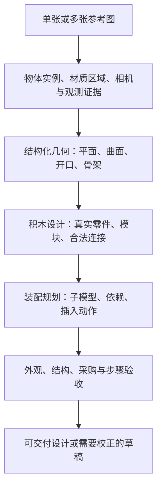

# Brickform：图片到可拼装模型的代码审查与解决方案

> 本文保留 2026-09-30 的审查与首次六图基线。当前识别器、源观测账本和材质候选已有后续实现；2026-10-04 的实测根因与下一工程切片见 [最新颜色链路审计](material-color-chain-audit-2026-10-04.md)，各批实现见 [实施进度](product-quality-implementation.md)。旧基线不能作为当前生产状态或成品质量成绩。

## 本次结论

用户要的是：上传图片，获得外形忠实、零件真实、能够购买和实际拼搭、步骤清楚的积木设计。当前系统完成了本机网格生成、积木排布、局部目录组件替换和说明书渲染，但没有完成通用积木设计。

最先应该解决的是识别错误和几何/材质整理。继续提高体素分辨率、添加神庙模板、移动组件安装点，无法解决任意图片的质量问题。

本次交付是代码审查、六张新增图片的真实本机推理与转换、可复用基准工具，以及下述实施方案。本文中的新设计阶段是提案，尚未实装；雕像后墙问题没有在本次被宣称修好。此前 PHASE 3/4/5 暂停的约束仍保留，不能把本次审计当成这些阶段已经完成。

## 1. 雕像后方为什么乱

复用最新本机单图草稿 `962d9da9ac500e96e6a81982/model.glb`，以 320 像素参考图离线重放配色、识别、48 凸点转换。离线得到 8,533 块；截图为 8,563 块，浏览器缩图与离线双线性缩图不能保证逐像素一致，因此不声称零件数量完全复现。碎墙和灰色补丁在离线结果中同样出现。

可定位的原因：

1. `surface-anchor-solver.ts` 的壁龛清除宽度上限固定为 **10 凸点**。原图检测到的壁龛宽度约占图片 27.3%，在大尺寸模型中只清除中央窄条，旁边的错误几何留了下来。上限最初服务于固定长度跨梁，不能作为整个开口的几何边界。
2. 壁龛后界固定为雕像安装点后退 **3 凸点**，没有拟合实际后墙。清除范围外的网格起伏继续被铺成砖。
3. `installCavityLintel()` 为跨梁补足承托；当错误网格屋顶有多个深度采样时，会保留/补出多段侧承托。它能解决跨梁连接，却没有评估这些侧承托是否符合照片。
4. `reference-colors.ts` 将可见三角面的照片颜色映射到 14 色积木色板。暗色凹陷可以成为深灰材料；照片阴影与真实灰色零件没有区域级区分。当前后墙采样中，同一行的正面深度从 10 到 15 凸点变化，部分深陷处为颜色编号 12（深灰），其余为编号 7（浅褐）。
5. `semantic-cut-cleanup.ts` 清理的是切口附近断开的分支。已经连在后墙上的错误体积会留下。`finishModel()` 还可能把不正确的体积连接起来，使它通过连通检查。

因此，后墙要经过“拟合平面、确认开口、确定材质”再排砖。直接扩大删除框可能破坏门楣、火盆基础和侧墙；全局把灰色改成浅褐会误删原图中的真实灰色装饰。

## 2. 新增六张图片实测

输入来自 [Hunyuan3D-2 的公开样例目录](https://github.com/Tencent/Hunyuan3D-2/tree/f8db63096c8282cb27354314d896feba5ba6ff8a/assets/example_images)，覆盖小屋、机车、马、头像、帽子、人物。它们是样例渲染/插画参考图，并非真实照片、官方乐高套装或独立于模型训练数据的评测集。这是跨类别缺陷检查，不能据此估计任意用户图片的成功率。

采用当前本机 Hunyuan3D mini：30 steps、octree 128、输入 SHA-256 确定随机种子；随后走实际 GLB 读取、参考配色、语义识别、组件事务、28 凸点积木转换和目录连接检查。不是直接把预制体素或真实三维几何送入排砖器。未调用付费三维 API。

| 输入 | 零件数 | 步骤数 | 辅助支撑 | 原图没有却实际安装的组件 | 现有连接检查 |
| --- | ---: | ---: | ---: | --- | --- |
| 蓝屋顶小屋 | 3,197 | 320 | 387 | 1 个火盆 | 通过 |
| 蒸汽机车 | 2,803 | 317 | 467 | 11 个火盆 | 通过 |
| 马 | 1,985 | 233 | 655 | 8 个火盆 | 通过 |
| 石膏头像 | 5,412 | 518 | 1,527 | 4 棵树 | 通过 |
| 巫师帽 | 3,281 | 339 | 1,006 | 7 个火盆 | 通过 |
| 穿服装人物 | 3,164 | 311 | 555 | 3 棵树 | 通过 |

六张都完成了转换，零件清单数量与模型一致，现有碰撞/连接检查都通过；六张也都出现明确的语义误安装。**结构检查通过不是产品验收通过。** 基准现在增加了人工标注的禁止组件类别，出现这些误安装时返回失败退出码。通过这个负例检查也仍不代表外观、承重或说明书合格。

图像和 GLB 缓存在本地 `outputs/image-benchmark/`，输入来源、哈希和负例标签在 `benchmarks/image-cases.json`；结构化实测结果在 `benchmarks/image-baseline-2026-09-30.json`。此轮不把外部样例图片或模型权重重新发布到仓库。

## 3. 代码各阶段的缺口

审查范围覆盖应用入口/worker、两种本机重建、云端重建接口、GLB 读取、配色/相机对齐、场景检测、组件检索、锚点/可见性、事务合成、体素填充/排砖、连接检查、指标、步骤与导出；普通 UI 组件库不承担生成质量。

| 阶段与主要代码 | 当前有效能力 | 对产品目标的缺口 |
| --- | --- | --- |
| `local-reconstruction.ts`、`local-multiview.py`、`multiview-fusion.py`、`meshy-server.ts` | 单图生成完整网格；三图估计相机/深度；保留错误日志和融合拦截 | 单图背面是推测；三图相机/深度一致性不保证；未观察区域缺少完整的来源/置信度数据流 |
| `read-glb.ts`、`reference-colors.ts` | 导入真实三角面、参考视角配色、避免把前景颜色无条件复制到背面 | 视角主要靠轮廓匹配；材质与光照未分离；每面单色与小色板造成补丁；没有材质区域 |
| `image-semantics.ts`、`scene/*`、`semantic-refinement.ts` | 保留独立实例、语义元数据和已有三个类别的增强 | **当前默认识别器是颜色阈值，不是通用物体识别模型**；类型中声明 vehicle/animal 等，不代表已有相应检测/生成能力 |
| `component-library.ts`、`component-retrieval.ts`、`component-parts.ts` | 有真实目录零件组成的树、火盆、人物和简化表达 | 只有三个执行类别；检索主要按类别/大小/颜色打分；`geometryEmbedding` 字段没有实际检索实现；无法识别任意官方零件编号 |
| `surface-anchor-solver.ts`、`semantic-clearance.ts`、`visibility-validation.ts` | 接触面、法线、底座连接、投影/深度检查 | 固定范围安装与清除不能代替墙面/开口设计；存在深度警告下仍提交的主视觉组件；可见性不等于外形相似 |
| `mesh-design.ts`、`brick-engine.ts` | 一次体积填充、多次事务尝试、保留失败原几何、基础砖/薄板/光面砖排布 | 把预测噪声当目标体积；中央 30%–70% 保护范围仍为固定几何规则；补支撑侧重连接；没有通用曲面、窗洞、骨架设计 |
| `structure-classifier.ts`、`procedural-structures.ts` | 特定稀疏高塔可用结构化表达 | 几何比例分类会把机车/马称为 stepped-monument；这些名称不是可靠语义；通用细长物不能据比例强行变为塔架 |
| `horizontal-surfaces.ts`、`aesthetic-packing.ts` | 小范围一层薄板平台去噪、局部光面收口、冗余支撑移除 | 平台修整不是全模型设计；`surfaceRegularityScore` 实际是小砖比例，`randomVoxelNoisePenalty` 恒为 0；没有测量真实表面起伏/照片差异 |
| `assembly-catalog.ts`、`special-connectors.ts`、`assembly-validation.ts`、`structure-metrics.ts` | 目录尺寸、连接点、连通性、相邻砖错缝指标 | 未计算载荷/力矩；碰撞主要用包围体，同一语义组件及部分附件连接有排除规则；没有精确插入路径、连接强度和过程稳定性验证 |
| `image-design.ts`、`build-instructions.ts`、`manual.ts`、`build-guide.tsx` | 一致的模型/BOM/步骤、零件定位与图示 | 普通步骤主要按高度，每组最多 12 件；不是模块化装配规划；没有覆盖每步遮挡、手部空间、插入可行性与实物初学者测试 |
| `rounded-duck.ts`、`brick-reader.ts`、`multiview.ts` | 专用鸭子拟合、正面读砖、正交轮廓交集 | 专用路径的好结果不能代表通用照片能力；正交轮廓不能恢复隐藏凹面；渲染图不一定严格正交或同一几何 |
| `benchmarks/*`、`*.test.ts` | 大量合成回归，神庙真实失败草稿已有可携带 fixture | 广泛图像负例此前缺失；`surface-anchor-solver.test.ts` 仍依赖忽略的 `outputs/` 文件，干净克隆不能完整复现该组测试 |

### 识别器里两个具体问题

- 密集橙红色像素被直接命名为 `brazier`。密度可以增加 confidence，却没有证明“这个物体是火盆”。机车铜色装饰和马身上高饱和暖色因此被替换。
- 绿色规则允许 `r - g <= 10` 且 `g - b >= 12` 的暖灰阴影进入树类别。普通雕像阴影也可能满足条件。合并树碎片的代码要求 anchorConfidence < 0.8，但默认检测器只赋值 0.8 或 0.9，所以这段合并逻辑对它自己产生的候选不生效。

这些不能仅靠再改一组 RGB 阈值彻底解决：同样颜色既可以属于墙、衣服、叶子，也可以属于火焰。

## 4. 建议的新生成链路

### A. 识别必须输出证据

在现有 `SceneDetector` 接口后接实例识别/分割模型。颜色只辅助估计材质。输出身份置信度、对象 mask、安装底部、可见边界；分别标注“看见了什么”和“安装在哪里”。一个很可靠的安装点不能提高物体身份的置信度。

对未知对象保留几何草稿，并允许轻量校对。目录件自动替换必须先通过身份与形状验证。加入“不存在任何火盆的橙色物体”“不含植物的暖灰雕像”“同一棵树的碎片”“真实火盆”负例/正例对照，防止只修正漏检又引入误检。

本机实现先选择符合内存预算的识别/分割模型并用独立图片评测；不能仅依据模型名称或一次神庙效果确定选型。没有测得误检率前，不应把规则置信度包装为视觉模型置信度。

### B. 增加结构化几何与区域材质阶段

`TriangleMesh` 是观测草稿，增加 `DesignGeometry`：平面 patch、曲面 patch、开口/负空间、区域材质、观测/推测来源及误差。先去除离群点、拟合平面、整理边界，再决定保留哪些细节。

神庙的最小验证切片：从图像支持的入口边界和网格法线估计门框及后墙平面；投影验证通过后，统一后墙平面与局部主材色；保留雕像底座、火盆、真实灰色装饰和空腔。开口宽度跟随几何，跨梁选择跟随跨度。大于 8 凸点的跨度用经过检查的多件梁/承托方案，不能缩小开口迁就某一种梁。

区域材质用聚类与光照归一，而非所有暗像素变灰砖；缺少证据的区域采用明确的设计材质。真实地面嵌色、黑色火盆与灰色装饰必须有各自区域，避免全局涂色误伤。统一地面铺砖意图，连接点上保留凸点，展示地面选光面砖；砖缝作为排布结果，不能把照片里的砖缝当高低差。

建筑采用平面/墙体/台阶/窗洞约束；车辆采用底盘/轮组/车身模块；动物采用轴线/肢体/曲面模块。复用的是局部构造与连接方法，不能把所有模型替换成同一套神庙或铁塔。

### C. 真实零件的选择与排布

保留现有目录几何、姿态、连接点和事务回滚。扩展零件目录的同时建立真实的零件–颜色可用组合，区别“一件特殊零件”和“多件组成的模块”。火盆、树、人物当前是多件组装，不可统一宣传为一颗官方零件。

对每个几何区域搜索砖、薄板、光面砖、斜坡、曲面砖和必要的侧向连接。硬约束包含尺寸、合法连接、碰撞、禁占开口、整体连通；软目标包含照片轮廓/特征相似、平面一致、颜色区域一致、支撑可见程度、零件数量与可采购性。局部失败用删除重建/候选搜索，避免全局反复修改语义范围。

照片中已有乐高套装时，可加入零件候选识别与 CAD 投影匹配；仍无法从一张图读出被遮挡的内部零件清单。可上传 `.ldr/.mpd` 或已知套装清单的用户，应走直接零件模型路径，减少不必要的网格重建。

### D. 可拼搭与步骤共同设计

把模型拆成可独立搭建的模块：底座、墙体、屋顶、轮组、人物等。每个模块有局部零件与连接接口；规划子装配和接入主体的动作。先检查每步的真实连接、临时稳定性、插入方向与扫掠空间，再生成视角、放大框、方向箭头和本步清单。

每步新增零件应可看见并能定位；需要翻转时明确示意；相似但方向不同的零件给出尺寸和朝向。每一步编号、动画、导出清单都复用同一份装配计划。

结构连通检查保留作为必要条件，另行引入重心/支承与连接力分析，参数须用真实零件/试拼校准。小模型先由真人从说明书完整试拼；没有这一步不能认定套装式交付已经成立。

## 5. 实施顺序与验收

下面是新的工作包建议，不代表已执行旧 PHASE 3/4/5。先建立明确门槛，再投入长任务。每项只改一个阶段，并对同一批输入缓存重放，减少重复本机推理与额度消耗。

| 顺序 | 交付 | 合格门槛 |
| --- | --- | --- |
| 1 | 可复现跨类别基准、身份/安装置信度分离、实例识别与分割适配器 | 本轮六图禁止组件误安装为 0；真实神庙雕像与两只火盆仍保留；树碎片不会无限拆成实例；模型与输入指纹一致 |
| 2 | 结构化平面、开口和材质；先修壁龛与平台 | 神庙 28/36/48 三档后墙共面，区域内无无依据的杂色、无补柱占用开口；正常台阶/装饰保留；旋转四视角确认；无新碰撞/断开 |
| 3 | 区域零件搜索、错缝骨架、采购组合约束 | 已声明平面的高差为 0；展示地面按连接需求铺面；全部零件–颜色组合有来源或替代方案；支撑不掩盖主体关键特征 |
| 4 | 子装配与动作规划、步骤可见性与过程校验 | 无未连接新件、无插入碰撞；每件新增零件有可辨认图示；导出与动画一致；记录不可验证的载荷/连接，不笼统标为稳定 |
| 5 | 独立图片与真人试拼验收 | 至少 30 张独立图片覆盖建筑、车辆、动物、家具、植物，三档分辨率；记录质量失败而非静默成功；至少 5 个跨类别模型完整试拼，记录误装、遗漏、返工和弱连接 |

这里的数字是建议的验收目标，不是已获得的成绩。逐项测量后才决定是否扩展范围。真实照片、多物体杂乱背景、透明反光物、极细结构，应单列评估，不能被干净渲染样例的成绩覆盖。

## 6. 单图、多图与产品承诺

单图可以作为积木设计的入口，但有不可见区域。目标可以是“按图片设计一个忠实且可拼的模型”；不能从单张照片保证原模型背面、内部零件与隐藏连接完全相同。

三图能提供更多约束，但相机、尺度、图间一致性必须可靠。相机错误时，增加图片反而增加矛盾。优先使用同一真实物体的连续照片，或同一 CAD 模型的已知相机渲染；独立生成的三张图片即使风格相同，也需要核对几何是否一致。

建议让单图/多图共用结构化几何、积木设计、质量评估和说明书下游。上游重建器分别负责提供观测与置信度。低质量结果应停留在可校正草稿，给出具体原因与最少补充操作，不能仅因为成功生成文件就进入“可交付”状态。

## 7. 研究与外部参照

- [Legolization: Optimizing LEGO Designs](https://www.cs.columbia.edu/~yonghao/siga15/abstsiga15.html)：研究把力学稳定性和局部排布优化联系起来，并用真实积木模型验证。它支持“在连接之外增加稳定性分析”这条技术路线，不是可直接接入本项目的完整官方套装设计器。
- [StableLego](https://arxiv.org/abs/2402.10711)：研究基于力平衡的积木稳定性分析，可作为后续模型和验证参考。引入它仍需适配实际目录件、连接方式及参数。
- [MapAnything 官方仓库](https://github.com/facebookresearch/map-anything)：框架支持图像及额外几何输入。当前本机 MLX 调用采用图像推理，不能把官方框架可接入已知位姿当成本项目已经完成相机约束。
- [LDraw 格式规范](https://www.ldraw.org/article/218.html)：提供零件引用、姿态、步骤及子模型格式的基础，可用于可编辑的零件设计导出。LDraw 的官方零件库称谓不等于 LEGO Group 对生成模型的认证。
- [LEGO 10320 官方说明书入口](https://www.lego.com/en-us/service/building-instructions/10320)：作为模块化说明书的人工作品对照来源；此轮未完成该套装说明书的逐页评测，不把其页面设计归纳为已验证的新功能。

本方案是基于代码和实测的工程建议。更换重建模型、增加三张图或通过更多单元测试，都不能单独保证最终可拼搭质量。
